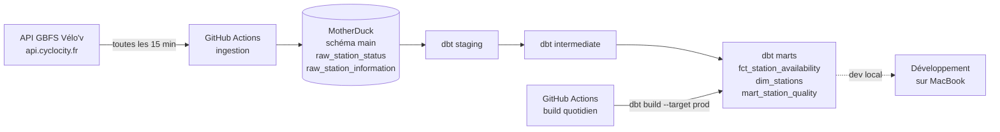
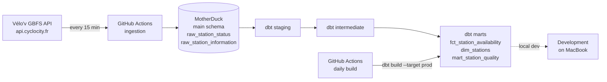

# Vélo'v Analytics Pipeline

Pipeline de données temps réel sur le réseau de vélos en libre-service Vélo'v (Lyon), construit avec **dbt + DuckDB + MotherDuck**, orchestré par **GitHub Actions**.

[🇫🇷 Français](#-français) | [🇬🇧 English](#-english)

---

## 🇫🇷 Français

### Contexte

Ce projet ingère en continu les données du flux temps réel Vélo'v (GBFS) et les transforme avec dbt pour produire des tables analytiques fiables, testées et documentées. Il sert de portfolio : l'objectif n'est pas seulement de "faire tourner un pipeline", mais de montrer une démarche d'analytics engineer face à des données réelles et imparfaites — définir des règles de qualité, les calibrer sur des observations, et documenter honnêtement ce qui a changé en cours de route.

### Architecture



- **Ingestion** : un script Python (`ingestion/fetch_velov.py`) interroge le flux GBFS (`station_status` et `station_information`, sans authentification) et insère chaque snapshot directement dans MotherDuck. Un job GitHub Actions planifié (`*/15 * * * *`) l'exécute en continu, sans dépendre d'un ordinateur allumé.
- **Stockage** : MotherDuck héberge la base `velov_analytics`. Les tables brutes vivent dans le schéma `main`, alimentées par un service account dédié (token stocké comme secret GitHub).
- **Transformation** : dbt (adapter `dbt-duckdb`) construit staging → intermediate → marts. Un second workflow GitHub Actions lance `dbt build --target prod` chaque matin, avec vérification de la fraîcheur des sources.
- **Environnements** : `dev` (développement local sur MacBook, géré avec `uv`) et `prod` (schéma dédié, alimenté automatiquement).

### Stack technique

| Composant | Choix | Pourquoi |
|---|---|---|
| Gestion Python | `uv` | rapide, lockfile reproductible |
| Entrepôt | DuckDB + MotherDuck | analytique, serverless, free tier suffisant pour ce volume |
| Transformation | dbt-duckdb | staging/marts, tests, documentation versionnés avec le code |
| Ingestion | Python (`requests`, `duckdb`) | appel direct du flux GBFS, écriture directe dans MotherDuck |
| Orchestration | GitHub Actions | gratuit, pas d'infra à gérer, secrets natifs |

### Structure du repo

```
velov-analytics/
├── .github/workflows/
│   ├── ingest.yml          # ingestion toutes les 15 min
│   └── dbt_build.yml       # build + tests quotidiens (target prod)
├── ingestion/
│   └── fetch_velov.py
├── dbt_project/
│   ├── models/
│   │   ├── staging/velov/
│   │   ├── intermediate/
│   │   └── marts/
│   ├── tests/               # tests singuliers (ex: taux d'écart de capacité)
│   ├── profiles.yml          # sans secret, token via variable d'environnement
│   └── dbt_project.yml
├── pyproject.toml
└── README.md
```

### Modèles dbt

- **Sources** (`raw_station_status`, `raw_station_information`) : test de fraîcheur (`warn` à 30 min, `error` à 2h), pour détecter un arrêt de l'ingestion.
- **Staging** : renommage, typage (ex. conversion du timestamp Unix `last_reported`), aplatissement de la structure imbriquée `vehicle_types_available`.
- **Intermediate** (`int_velov__station_availability`) : jointure statut + référentiel, calcul des métriques dérivées (`capacity_gap`, `occupancy_rate`, `is_operational`).
- **Marts** :
  - `fct_station_availability` — table de faits **incrémentale** (`delete+insert`, fenêtre de rattrapage d'1h pour absorber les snapshots partiels).
  - `dim_stations` — dernière version connue de chaque station (déduplication par `row_number()`).
  - `mart_station_quality` — une ligne par station, profil de qualité calculé sur tout l'historique (voir cas d'étude ci-dessous).

Les seuils de qualité (tolérance de capacité, taux d'alerte, durée de dormance...) sont des **variables dbt** (`dbt_project.yml`), pas des constantes enfouies dans le SQL.

### Reproduire le projet

```bash
git clone <votre-repo>
cd velov-analytics
uv sync
cd dbt_project
uv run dbt deps
export MOTHERDUCK_TOKEN="votre_token"
uv run dbt build
```

---

## Cas d'étude : qualité de données

### 1. Cohérence des capacités (`capacity_gap`)

**Le test.** Pour chaque station, la capacité devrait être égale à la somme : vélos disponibles + vélos hors service + bornes libres + bornes hors service. J'ai exprimé cette règle sous la forme d'une colonne `capacity_gap` (capacité moins cette somme, attendue à 0) et d'un test dbt.

**Calibration initiale (sur ~14h d'historique, 26 970 mesures, 465 stations).** 23 % des mesures présentaient un écart non nul, mais très inégalement réparti :

| Population | Lignes avec écart | Écart moyen |
|---|---|---|
| Station active (installée, location et retour ouverts) | 5 795 | 1,8 |
| Station non installée (aucun rapport depuis longtemps) | 290 | 16 |
| Installée, location fermée, retour ouvert | 234 | 21 |

Sur les stations opérationnelles, l'écart médian était de 0, le 95e percentile de 2, le 99e de 5 (maximum 19), et 1,5 % des mesures dépassaient un écart de 3. Trois mesures étaient au-dessus de la capacité (écart de -1), chacune sur une station différente et un seul snapshot : du bruit ponctuel plutôt qu'un changement durable.

**Hypothèse (non vérifiée).** Les petits écarts sur stations actives pourraient venir d'un décalage entre compteurs, ou de vélos en cours de verrouillage que l'API ne déclare ni disponibles ni hors service.

**Décisions.**
- Une tolérance d'une unité sous la capacité (`capacity_gap >= -1`), sur toutes les lignes : un -1 isolé n'est pas alarmant, un écart plus négatif le serait.
- Un test de **taux** plutôt qu'un compte absolu : alerte si plus de 3 % des mesures des dernières 24h sur stations opérationnelles ont un écart supérieur à 3. Un compte absolu sur une table qui grossit en continu aurait alerté en permanence.
- Les deux tests sont en `warn` : un écart est une information sur la donnée, pas une panne du pipeline.
- Les seuils sont provisoires, calibrés sur un historique court, et seront réévalués à mesure qu'il grossit.

### 2. Profil qualité par station (`mart_station_quality`)

Un mart classe chaque station selon son historique complet, en quatre statuts au-delà de `ok` :
- **`dormant`** : aucun rapport depuis plus de 7 jours.
- **`closed_but_reporting`** : non opérationnelle, mais rapporte activement (fermeture signalée, par opposition à une station simplement muette).
- **`silent_while_operational`** : se déclare active mais tous les compteurs sont à zéro — un cas qui aurait été invisible dans un test au niveau ligne.
- **`constant_gap`** : écart de capacité identique sur toutes les mesures opérationnelles (avec un minimum d'observations pour éviter les faux positifs sur de courtes fenêtres).

**Vérification externe.** J'ai recoupé trois stations avec l'application officielle : deux sont fermées pour travaux (réouverture annoncée en octobre 2026), ce qui correspond à leur statut `closed_but_reporting` ; la troisième, sans nom dans le flux (un test dédié sur les noms vides l'a signalée, puisque `not_null` ne suffit pas à détecter une chaîne vide), est fermée jusqu'à fin 2026 et apparaît comme `dormant`. Ce dernier cas montre que "dormant" recouvre aussi des fermetures temporaires, pas seulement des stations désaffectées — l'API ne fournit ni motif ni date de réouverture, donc la classification décrit le comportement du flux, pas sa cause. Trois stations choisies à la main sont cohérentes avec la classification, mais ne constituent pas une validation statistique.

Par ailleurs, `last_reported` ne semble pas un indicateur de vivacité fiable pour une station saine : sur les stations `ok`, la médiane était de 6h et le maximum observé de 8,8h, ce qui rend le seuil de dormance (7 jours) peu sensible à ce signal.

**Sensibilité à la durée d'observation.** Le statut `constant_gap` s'est révélé instable dans le temps : 3 des 4 stations initialement concernées avaient un écart figé depuis près de 18h (jour et nuit compris), avant de se mettre à varier simultanément en fin d'après-midi. Ce n'est donc pas un artefact de faible activité nocturne comme je l'avais d'abord supposé, mais plutôt un événement ponctuel affectant plusieurs stations à la fois (hypothèse non vérifiée : un passage de rééquilibrage des vélos). Une seule station est restée figée sur toute la période observée, ce qui en fait un cas plus solide que les autres. J'ai relevé le garde-fou d'observation à environ 24h pour limiter les faux positifs sur de courtes fenêtres, en sachant que ce seuil ne capture pas un mécanisme déclenché par un événement plutôt que par le temps écoulé.

**Ce que ces deux cas illustrent.** Un test qui échoue ne signifie pas forcément qu'il faut "réparer" la donnée : ici, les tests ont servi de détecteurs pour comprendre le comportement du système source, et les premières conclusions ont dû être révisées à mesure que l'historique grandissait — ce qui est probablement plus représentatif d'un vrai projet d'analytics engineer qu'un pipeline qui "marche du premier coup".

### Prochaines étapes

- Mart d'usage horaire (`mart_station_usage_hourly`) une fois 1 à 2 semaines d'historique accumulées, pour capturer les rythmes hebdomadaires.
- Dashboard de restitution (Evidence ou Streamlit) branché sur MotherDuck.
- Couche semantic layer / MetricFlow, envisagée selon l'évolution du projet.

---

## 🇬🇧 English

### Context

This project continuously ingests real-time data from the Vélo'v bike-share network (GBFS feed) and transforms it with dbt into reliable, tested and documented analytical tables. It serves as a portfolio project: the goal isn't just to "run a pipeline", but to demonstrate an analytics engineering approach to real, imperfect data — defining quality rules, calibrating them against observations, and honestly documenting what changed along the way.

### Architecture



- **Ingestion**: a Python script (`ingestion/fetch_velov.py`) queries the GBFS feed (`station_status` and `station_information`, no authentication required) and inserts each snapshot directly into MotherDuck. A scheduled GitHub Actions job (`*/15 * * * *`) runs it continuously, independent of any laptop being on.
- **Storage**: MotherDuck hosts the `velov_analytics` database. Raw tables live in the `main` schema, fed by a dedicated service account (token stored as a GitHub secret).
- **Transformation**: dbt (`dbt-duckdb` adapter) builds staging → intermediate → marts. A second GitHub Actions workflow runs `dbt build --target prod` every morning, with a source freshness check.
- **Environments**: `dev` (local development on a MacBook, managed with `uv`) and `prod` (dedicated schema, fed automatically).

### Tech stack

| Component | Choice | Why |
|---|---|---|
| Python management | `uv` | fast, reproducible lockfile |
| Warehouse | DuckDB + MotherDuck | analytical, serverless, free tier sufficient for this volume |
| Transformation | dbt-duckdb | staging/marts, tests and docs versioned with the code |
| Ingestion | Python (`requests`, `duckdb`) | direct GBFS calls, writes straight into MotherDuck |
| Orchestration | GitHub Actions | free, no infra to manage, native secrets |

### Repo structure

```
velov-analytics/
├── .github/workflows/
│   ├── ingest.yml          # ingestion every 15 min
│   └── dbt_build.yml       # daily build + tests (target prod)
├── ingestion/
│   └── fetch_velov.py
├── dbt_project/
│   ├── models/
│   │   ├── staging/velov/
│   │   ├── intermediate/
│   │   └── marts/
│   ├── tests/               # singular tests (e.g. capacity gap rate)
│   ├── profiles.yml          # no secrets, token via environment variable
│   └── dbt_project.yml
├── pyproject.toml
└── README.md
```

### dbt models

- **Sources** (`raw_station_status`, `raw_station_information`): freshness test (`warn` at 30 min, `error` at 2h), to catch an ingestion outage.
- **Staging**: renaming, typing (e.g. converting the Unix timestamp `last_reported`), flattening the nested `vehicle_types_available` structure.
- **Intermediate** (`int_velov__station_availability`): joins status + reference data, computes derived metrics (`capacity_gap`, `occupancy_rate`, `is_operational`).
- **Marts**:
  - `fct_station_availability` — **incremental** fact table (`delete+insert`, 1-hour lookback window to absorb partial snapshots).
  - `dim_stations` — latest known version of each station (deduplicated via `row_number()`).
  - `mart_station_quality` — one row per station, a quality profile computed over the full history (see case study below).

Quality thresholds (capacity tolerance, alert rate, dormancy duration...) are **dbt variables** (`dbt_project.yml`), not constants buried in SQL.

### Reproducing the project

```bash
git clone <your-repo>
cd velov-analytics
uv sync
cd dbt_project
uv run dbt deps
export MOTHERDUCK_TOKEN="your_token"
uv run dbt build
```

---

## Data quality case studies

### 1. Capacity consistency (`capacity_gap`)

**The test.** For each station, capacity should equal the sum of available bikes, disabled bikes, available docks and disabled docks. I encoded this rule as a `capacity_gap` column (capacity minus that sum, expected to be 0) and a dbt test.

**Initial calibration (on ~14h of history, 26,970 measurements, 465 stations).** 23% of measurements showed a non-zero gap, but very unevenly distributed:

| Population | Rows with a gap | Average gap |
|---|---|---|
| Active station (installed, renting and returning enabled) | 5,795 | 1.8 |
| Not installed (no report for a long time) | 290 | 16 |
| Installed, renting disabled, returning enabled | 234 | 21 |

On operational stations, the median gap was 0, the 95th percentile 2, the 99th 5 (maximum 19), and 1.5% of measurements exceeded a gap of 3. Three measurements were above capacity (gap of -1), each on a different station and a single snapshot: isolated noise rather than a lasting change.

**Hypothesis (not verified).** The small gaps on active stations may come from counter timing differences, or from bikes mid-lock that the API reports as neither available nor disabled.

**Decisions.**
- A one-unit tolerance below capacity (`capacity_gap >= -1`), on all rows: an isolated -1 is not alarming, a more negative gap would be.
- A **rate** test rather than an absolute count: alert if more than 3% of the last 24 hours of measurements on operational stations show a gap above 3. An absolute count on a continuously growing table would warn forever.
- Both tests use `warn`: a gap is information about the data, not a pipeline failure.
- Thresholds are provisional, calibrated on a short history, and will be revisited as it grows.

### 2. Per-station quality profile (`mart_station_quality`)

A mart classifies each station from its full history, into four statuses beyond `ok`:
- **`dormant`**: no report for more than 7 days.
- **`closed_but_reporting`**: not operational, but actively reporting (an announced closure, as opposed to a station that has simply gone silent).
- **`silent_while_operational`**: declares itself active but every counter reads zero — a case that would have been invisible to a row-level test.
- **`constant_gap`**: identical capacity gap across all operational measurements (with a minimum observation count to avoid false positives on short windows).

**External check.** I cross-checked three stations against the official app: two are closed for works (reopening announced for October 2026), matching their `closed_but_reporting` status; the third, which has no name in the feed (a dedicated empty-name test flagged it, since `not_null` alone doesn't catch an empty string), is closed until the end of 2026 and appears as `dormant`. This last case shows that "dormant" also covers temporary closures, not just decommissioned stations — the API provides neither a reason nor a reopening date, so the classification describes the feed's behaviour, not its cause. Three hand-picked stations are consistent with the classification but are not a statistical validation.

Also, `last_reported` does not appear to be a reliable liveness signal for a healthy station: among `ok` stations, the median was 6h and the observed maximum 8.8h, which makes the dormancy threshold (7 days) fairly insensitive to this signal.

**Sensitivity to observation length.** The `constant_gap` status proved unstable over time: 3 of the 4 initially flagged stations had a frozen gap for close to 18 hours (spanning day and night), before starting to vary simultaneously in the late afternoon. This is not a low-nighttime-activity artifact as I first assumed, but more likely a one-off event affecting several stations at once (unverified hypothesis: a bike-rebalancing pass). Only one station stayed frozen throughout the observed period, making it a stronger case than the others. I raised the observation guard to about 24 hours to limit false positives on short windows, while acknowledging this threshold doesn't capture a mechanism triggered by an event rather than elapsed time.

**What these two cases illustrate.** A failing test doesn't necessarily mean the data needs "fixing": here, tests acted as detectors that helped understand the source system's behaviour, and early conclusions had to be revised as history grew — which is probably more representative of real analytics engineering work than a pipeline that "just works" on the first try.

### Next steps

- Hourly usage mart (`mart_station_usage_hourly`) once 1-2 weeks of history have accumulated, to capture weekly rhythms.
- A reporting dashboard (Evidence or Streamlit) connected to MotherDuck.
- A semantic layer / MetricFlow layer, considered depending on how the project evolves.